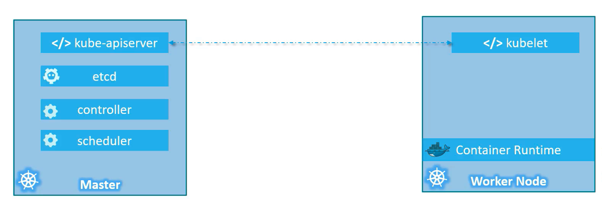
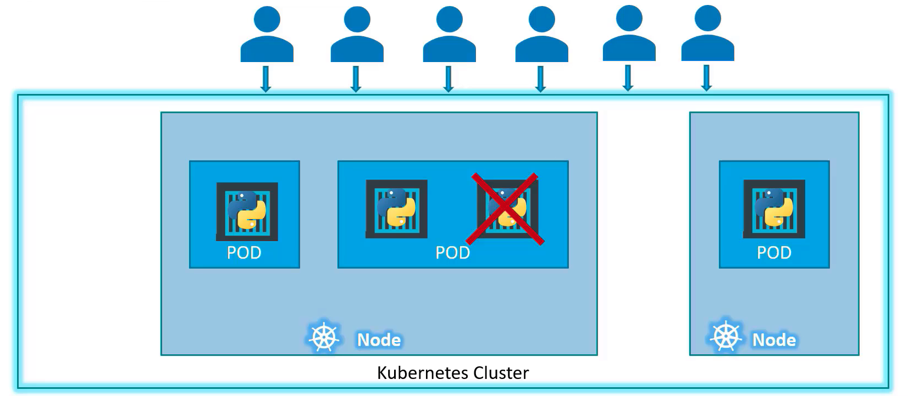
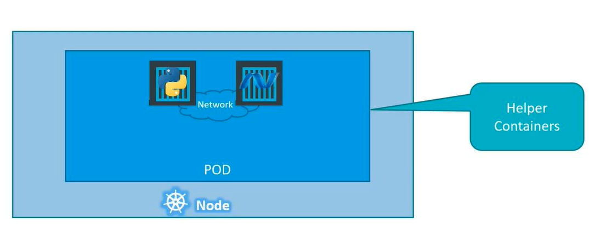
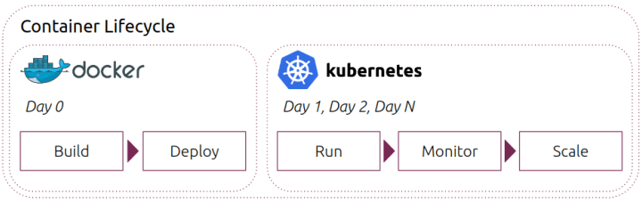
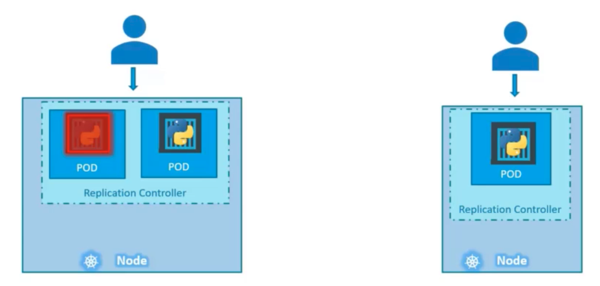
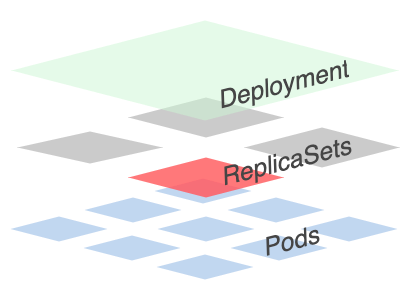
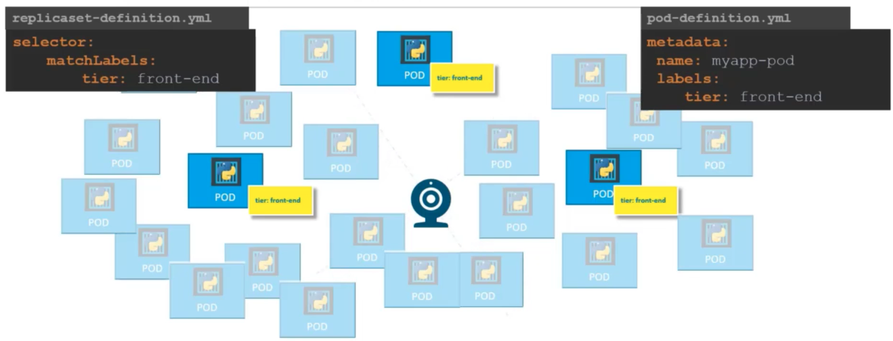

## Basic Concepts

**Node:** Node is a machine, physical or virtual one which Kubernetes installed. And node is a worker machine and that is where containers will be launchaned by Kubernetes. It was also known as minion's in the past.

**Cluster:** Cluster is a set of nodes grouped together.
Master node watches over the Nodes in the cluster and is responsible for the actual orchestration of containers on the worker nodes.

When you install Kubernetes on a system you're actually installing the following components.

- **An Api Server:** API Server acts as the fron end for Kubernetes. The users, management devices, command line interfaces; all talk to the API server to interact with Kubernetes cluster.
- **An etcd service:** Etcd service is a distributed reliable key-value store used by Kubernetes to store all data used to manage the cluster. When you have multiple nodes and multiple masters in your cluster, etcd store all that information on all the nodes in the cluster in a distributed manner. etcd is responsible for implementing locks within the cluster to ensure that there are no conflict between the masters.
- **A kubelet service:** Kubelet is the agent that runs on each node in the cluster. The agent is responsible for making sure that the containers are running on the nodes as expected. s
- **A Container Runtime:** The container runtime is the underlying software that is used to run containers. In our case it happens to be Docker, but there are other options as well.
- **Controllers:** The controllers are the brain behind orchestration. They are responsible for noticing and responding when nodes, conatiners or end points goes down.
- **Schedulers:** The scheduler is responsible for distributing work or containers across multiple nodes. It looks for newly created containers and assigns them to nodes. The controllers make decions to bring up new containers in such cases.

    

How are these components distributed across different types of servers. The worker node or minion as it is also known is where the containers are hosted. For example Docker containers and to run Docker containers on a system we need container **Container RunTime** installed. This does not have to be Docker, there are other container runtime alternatives available such as **rkt** (rocket) or **CRI-O**

The master server has the **kube-apiserver** and that is what makes it a master. Similarly the worker nodes have to **kubetet** agent that is responsible for interacting with a master to provide health information of the worker node and carry out actions requested by the Master on the worker nodes. 
All the information gathered are stored in a key value store on the master. The master also has the control manager and the scheduler.

**kubectl (kube control):** The kube control tool is used to deploy and manage applications on a Kubernetes cluster.

**Examples:**

- View information about the cluster
    ```
    kubectl cluster-info
    ```

- List all nodes part of the cluster**
    ```
    kubectl get nodes
    ```

#### POD

Kubernetes does not deploy conatiners directly on the worker nodes. The containers are encapsulated into a Kubernetes object known as pods. A pod is a single instance of an application. A pod is the smallest object that you can create in Kubernetes



What if you need to scale your application? 
You need to add additional instances of your Web application to share the load. Where would you pin up additioanl instances?
Do we bring up new container instance within the same pod? 
The answer is no.
We need to create a new pod with a new instance of the same application. As you can see, we have two instances of the Web application running on two separate pods on the same Kubernetes at a node.
So what if the load gets higher and the current node doesn't have enough capacity? 
Well, then you can always deploye additional pods on a new node in the cluster. You will have a new node added to the cluster to expand the cluster physical capacity.

A single pod can have multiple containers, exccpt for the fact that they're usually not multiple conatiner of the same kind.
If our intention is to scale our application, then we would need to create additional pods.



But sometimes we might have a scenario where we have a helper container that might be doing some kind of supporting task for our Web application, such as processing a user enter data, processing a file uploaded by the user, etc. and you want these helper containers to live alongside your application container.

In that case, you can have both of these containers, part of the same pod, so that when a new application conatiner is created, the helper is also created and when it dies, the helper also dies. Since they are part of the same pod.

The two containers can also communicate with each other directly by referring to each other as localhost, since they share the same network space. Plus they can easily share the same storage space as well.

##### Docker vs Kubernetes



A fundamental difference between Kubernetes and Docker is that Docker is a containerization platform, and Kubernetes is a container orchestrator for container platforms like Docker.

In Docker, we would need to establish network connectivity between containers ourselves using links and networks. 

We would need to create sharable volumes and shared among the containers and need to maintain a map of that as well. 

And most importantly, we will need to monitor the state of the application container, and when it dies, we will manually kill the helper container as it is no longer needed.

When a new container is deployed, we would need to deploy the new helper container as well with pod.

Kubernetes does all of this for us automatically. We just need to define what containers a pod consists of and the containers in a pod by default will have access to the same storage, the same network, namespace and same fate as in they will be created together and destroyed together.

Even if our application didn't happen to be so complex and we could live with a single container, Kubernetes still requires you to create pods.

This is good in the long run as your application is now equipped for architectural changes and scale in the future.

**After this step, Kubernetes must be installed in order to test the commands. You can use the links below for installation.***


<a href="https://kubernetes.io/docs/tasks/tools/install-kubectl-linux/" target="_blank">**`Installation Guide for Linux`**</a>

<a href="https://kubernetes.io/docs/tasks/tools/install-kubectl-macos/" target="_blank">**`Installation Guide for MacOS`**</a>

<a href="https://kubernetes.io/docs/tasks/tools/install-kubectl-windows/" target="_blank">**`Installation Guide for Windows`**</a>

###### How to Deploy Pods?

```bash
$ kubectl run nginx --image nginx
pod/nginx created
```

`kubectl run nginx` command creates a pod automatically and deploys an instance of the nginx docker image, but where does it get application image from?

The application image and in this case the nginx image is downloaded from the repository docker hub. 
Docker hub is a public repository where the latest images of various applications are stored.

We could configure Kubernetes to pull the image from the public or a private repository within the organization.

Now that we have a pod created, how do we see the list of pods available. `kubectl get pods` command helps us see the list of pods in our cluster.

```bash
$ kubectl get pods
NAME    READY   STATUS    RESTARTS   AGE
nginx   1/1     Running   0          8m57s
```
We have create nginx but how a user can access the nginx Web server? So, in the current state, we have not made the Web server accessible to external users. We can access it internally from the node but for now, we can not access the Web server from outside the node.

##### YAML in Kubernetes

Kubernetes uses YAML files as inputs for the creation of objects such as pods, replicasets, deployments, services, etc. All of these follow a similar structure. Kubernetes definition file always contains for top level fields.
The API version, kind, metadata and spec. These are the top level or root level properties. 
These are also required fields, so you must have them in your configuration file.

```properties
apiVersion: v1
kind: Pod
metadata:
    name: myapp-pod
    labels:
        app: myapp
        type: front-end

spec:
    containers:
        - name: nginx-container
          image: nginx
```
**apiVersion:** Version of the Kubernetes API we are using to create the object. Depending on what we are trying to create, we must use the right API version. Since we're working on pods, we will set the API version as `v1`. Few other possible values for this field are apps/v1-beta extension/v1-beta etc.

**kind:** kind  refers to type of object we are trying to create which in this case happens to be a pod. So, we will set it as `Pod`. Could be replica set, deployment or service.

**metadata:** The metadata is data about the object like its name, labels, etc. Unlike the first two where we have specified a string value this is in the form of a dictionary. So, everything under metadata is intended to the right a little bit and so name and labels are children of metadata. Children's (name and labels) locations should be the same as their sibling's.

Under metadata the name is a string value so we can name our pod. `myapp-pod` and the labels is a dictionary, so labels is a dictionary within the metadata dictionary. 
And it can have any key and value pairs as we wish. 

For now, we have added a label app with the value `myapp`. 

Similarly, we could add other labels as we see fit which will us identify these objects at a later point in time.

For example. there are hundreds of pods running a front end application and hundreds of pods running a backend application or a database. It will be difficult to group these pods once they're deployed.

If we label them now as `front-end` backend or database, we will be able to filter the parts based on this label at a later point in time.

It's important to keep in mind that under metadata we can only specify name or labels or anything else that Kubernetes expects to be under metadata.

We can not ad any other property as we wish under metadata. However under the labels we can have any kind of key or value pairs we see fit. 

So it's important to understand what each of these parameters expect.

**spec:** Spec is dictionary has a property under it called `containers`. Containers is a list an array. The reason this property is a list is because the pods can have multiple containers witin them. In this case, we will only add a single item in the list since we plan to have only a single container in the pod. 
The `-` right before the name indicates that this is the first item in the list. The item in the list is a dictionary so add name and image property the value for image is nginx which is the name of the Docker image in the docker repository.
Once the file is created from the command `kubectl create -f pod-definition.yml` followed by the file name which is pod-definition.yml and Kubernetes creates a pod.

The table below summarizes the Type of Fields.

|field     |type      | 
|----------|----------|
|apiVersion|string    |
|kind      |string    |
|metadata  |dictionary|
|name      |string    |
|labels    |dictionary|
|app       |string    |
|type      |string    |
|spec      |dictionary|
|containers|list      |

To create a pod with the above yml file;

```bash
$ kubectl create -f pod-definition.yml
pod/myapp-pod created
```
kubectl decribe command will tell us information about the pod; when it was created, what labels are assinged to it, what docker containers are a part of it, and the events associated with that pod.

```bash
$ kubectl describe pod nginx
Name:         nginx
Namespace:    default
Priority:     0
Node:         10.0.10.25/10.0.10.25
Start Time:   Fri, 22 Oct 2021 08:20:40 +0000
Labels:       run=nginx
Annotations:  <none>
Status:       Running
IP:           10.244.1.2
IPs:
  IP:  10.244.1.2
Containers:
  nginx:
    Container ID:   cri-o://bf5109681523311b60c40189b5efeee01114ff238f59861770b16def10f3aa7f
    Image:          nginx
    Image ID:       docker.io/library/nginx@sha256:644a70516a26004c97d0d85c7fe1d0c3a67ea8ab7ddf4aff193d9f301670cf36
    Port:           <none>
    Host Port:      <none>
    State:          Running
      Started:      Fri, 22 Oct 2021 08:20:48 +0000
    Ready:          True
    Restart Count:  0
    Environment:    <none>
    Mounts:
      /var/run/secrets/kubernetes.io/serviceaccount from default-token-kd5vg (ro)
Conditions:
  Type              Status
  Initialized       True 
  Ready             True 
  ContainersReady   True 
  PodScheduled      True 
Volumes:
  default-token-kd5vg:
    Type:        Secret (a volume populated by a Secret)
    SecretName:  default-token-kd5vg
    Optional:    false
QoS Class:       BestEffort
Node-Selectors:  <none>
Tolerations:     node.kubernetes.io/not-ready:NoExecute op=Exists for 300s
                 node.kubernetes.io/unreachable:NoExecute op=Exists for 300s
Events:          <none>
```

**Example:**

We can add anything on the labels that will help you group this section in the future.

```properties
apiVersion: v1
kind: Pod
metadata:
  name: myapp-pod
  labels:
    app: myapp
    type: front-end
    costcenter: EMEA
    location: Amsterdam
spec:
    containers:
        - name: nginx-container
          image: nginx
```

Before creating a pod with the above script, if it already exists, it can be listed and deleted with the following commands.

```bash
% kubectl get pods                  
NAME        READY   STATUS    RESTARTS   AGE
nginx       1/1     Running   0          2d19h

% kubectl delete pod nginx
pod "nginx" deleted

% kubectl create -f pod-definition.yml
pod/myapp-pod created
```

If you have more than 1 image and you want to list all image names, the below command can be used.

```
% kubectl describe pod | grep Image
    Image:          nginx
    Image ID:       docker.io/library/nginx@sha256:644a70516a26004c97d0d85c7fe1d0c3a67ea8ab7ddf4aff193d9f301670cf36
```

To find the nodes where the pods are located

```
% kubectl get pods  -o wide
NAME        READY   STATUS    RESTARTS   AGE     IP           NODE         NOMINATED NODE   READINESS GATES
myapp-pod   1/1     Running   0          4h18m   10.244.1.3   10.0.10.25   <none>           <none>
```

##### Editing Existing Pods

1. If you are given a pod definition file, edit that file and use it to create a new pod.

2. If you are not given a pod definition file, you may extract the definition to a file using the below command.

    ```bash
    kubectl get pod <pod-name> -o yaml > pod-definition.yaml
    ```

    Then edit the file to make the necessary changes, delete and re-create the pod.

3. Use the `kubectl edit pod <pod-name>` command to edit pod properties.

#### Kubernetes Replication Controllers



Containers are the brain behind Kubernetes. They're the processes that monitor Kubernetes objects and respond accordingly.

One of the most important controllers is the replication controller.

To prevent users from losing access to the application, we would like to have more than one instance or pod running at the same time. That way, If one fails, we still have our application running on the other one.

The replication controller helps us multiple instance of a single pod in the Kubernetes cluster, thus providing high availability.

Even if you have a single pod, the replication controller can help by automatically bringing up a new pod when the existing one fails, thus the replication controller ensures that the specified number of pods are running at all times, even if it's just one or hundred.

##### Load Balancing & Scaling

Another reason we need replication controller is to create multiple parts to share the load across them.

For example, we have a single pod serving a set of users, when the number of users increase, we deploy additional pod to balance the load across the two pods.

If the demand further increases and if we were run out if resources on the first node, we could deploy additional parts across the other nodes in the cluster.

It's important to note that there are two similar terms, `Replicaton Controller` and `ReplicaSet` both have the same purpose, but they're not the same.

Replication Controller is the older technology that is being replaced by ReplicaSet, is the new recommended way to set up replication.

**Replication Controller Example:**
The Replication Controller configuration file and the previously used configuration file are very similar to each other.

The extra thing to do here is to move all the contents of the pod definition (metadata and spec parts) to the template section of the file replication controller. They should be children of the template section.

Looking at our file now, we have two metadata sections; one is for the replication controller and another for the pod. And also we have two spec section one for each.

The replicas parameter is the number that determines how many pod there will be at a time. It is important to note that replicas and template sections are direct children of the spec section.

```properties
apiVersion: v1
kind: ReplicationController
metadata:
  name: myapp-rc
  labels:
    app: myapp
    type: frontend
spec:
  template:
   ---
```

```properties
apiVersion: v1
kind: ReplicationController
metadata:
  name: myapp-rc
  labels:
    app: myapp
    type: frontend
spec:
  template:
    metadata:
      name: myapp-pod
      labels:
        app: myapp
        type: front-end    
    spec:
      containers:
      - name: nginx-container
        image: nginx
  replicas: 3
```

Using the yaml file, to create a Replication Controller and check its status;

```bash
% kubectl create -f rc-definition.yml 
replicationcontroller/myapp-rc created

% kubectl get replicationcontroller
NAME       DESIRED   CURRENT   READY   AGE
myapp-rc   3         3         3       91s
```

If you would like to see the pods that were created by the replication controller and you will see three pods running. All of them are starting with the name of the replication controller which is myapp-rc, indicating that are all created automatically by the replication controller.

```bash
% kubectl get pods            
NAME             READY   STATUS    RESTARTS   AGE
myapp-rc-gfr2j   1/1     Running   0          54s
myapp-rc-kvq6d   1/1     Running   0          54s
myapp-rc-x4d2k   1/1     Running   0          54s
```

**Replicaset Example:**

It's very similar to replication controller. 
- apiVersion is different what we had before for application controller
- The spec section is exactly the same except!
  - ReplicaSet requires a selector definition, the selector section helps the ReplicatSet identify what pods fall under it. It's because ReplicaSet also manage pods that were not created as part of the ReplicaSet creation. For example, there were pods created before the creation of the ReplicaSet that matched labels specified in the selector. The ReplicaSet also take those pods into consideration when creating the replicas.
  The selector is not a required field in case of a replication controller, but it's still available. When you skip, it assumes it to be the same as the labels provided in the pod definition file. In case of ReplicaSet, a user input is required for this property and it has to be written in the form of `MatchLabels`.
- A MatchLabel selector simply matches the labels specified under it to the labels on the pod.
- The ReplicaSet selector also provides many other options for matching labels that were not available in the replication controller.

```properties
apiVersion: apps/v1
kind: ReplicaSet
metadata:
  name: myapp-replica
  labels: 
    app: myapp
    type: front-end
spec:
  template:
    metadata:
      name: myapp-pod
      labels:
        app: myapp
        type: front-end    
    spec:
      containers:
      - name: nginx-container
        image: nginx
  replicas: 3
  selector:
    matchLabels:
      type: front-end
```

Using the yaml file, to create a ReplicaSet and check its status;

```bash
% kubectl create -f replicaset-def.yml
replicaset.apps/myapp-replica created

% kubectl get pods                    
NAME                  READY   STATUS    RESTARTS   AGE
myapp-replica-kdl2k   1/1     Running   0          16s
myapp-replica-v5srg   1/1     Running   0          16s
myapp-replica-xnqbz   1/1     Running   0          16s

% kubectl get replicaset
NAME            DESIRED   CURRENT   READY   AGE
myapp-replica   3         3         3       41s
```

##### Labels and Selectors



Why do we label our pods and objects in Kubernetes?

Say we deployed three instances of our front-end Web application as three pods. We would like to create a replication controller or replicaset to ensure that we have three active pods at any time.

I case they were not created, the replicaset will create them for you. The role of the replicaset is to monitor the pods and if any of them were to fial, deploy a new ones. The replica set is in fact a process that monitors the pods.

There could be hundreds of other pods in the cluster running different applications. This is where labeling our pods during creation comes in handy.

```properties
metadata:
  name: myapp-pod
  labels:
    tier: front-end
```

```properties
selector:
  matchLabels:
    tier: front-end
```

We could provide labels as a filter for replicaset under the selector section, by using the matchLabels filter we can provide the same label we used when creating the pods.



This way the replicaset knows which pods of monitor.
The same conecpt of labels and selectors is used in many other places throughout Kubernetes.

##### Scale

Say we started with three replicas in the future we decided to sclae to six.
There are multiple ways to do it.

1. Update the number of replicas in the definition file to six.

    ```
    replicas: 6
    selector:
      matchLabels:
        type: front-end
    ```

    Then run the `kubectl replace -f replicaset-definition.yml` command to specify the same file and that will update the replica set to have six replicas.

2. Run the kubectl scale command used the replicas parameter to provide the new number of replicas and specify the same file as input.

    ```
    kubectl scale --replicas=6 -f replicaset-definition.yml
    ```

    We either input the definition file or provide the replicaset name in the type name format.

    ```
    kubectl scale --replicas=6 replicaset myapp-replicaset
    ```

    However, remember that using the filename as an input will not update the existing number of replicase in the file.
    In other words, the number of replicas in the replicaset-definition.yml file will still be three, even though you scaled your replica set to have six replicas using the kubectl scale command and the file as input.

##### Commands

- Create a replicaset 
  > kubectl create -f replicaset-definition.yml

- List of public assets created
  > kubectl get replicaset

- Delete the replicaset and also deletes all underlying PODs
  > kubectl delete replicaset myapp-replicaset

- Replace or update the replica set.
  > kubectl replace -f replicaset-definition.yml

- Scale replicaset simply from the command line without having to modify the file
  > kubectl scale -replicas=6 -f replicaset-definition.yml