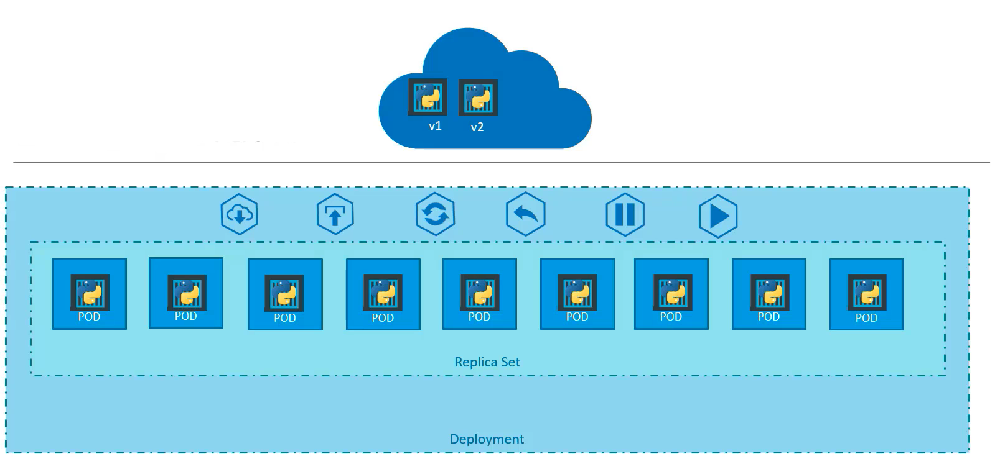
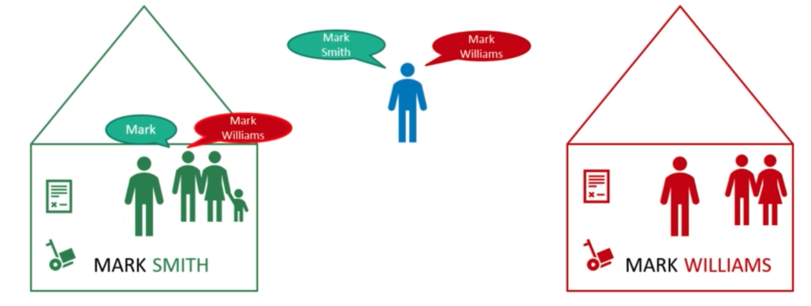
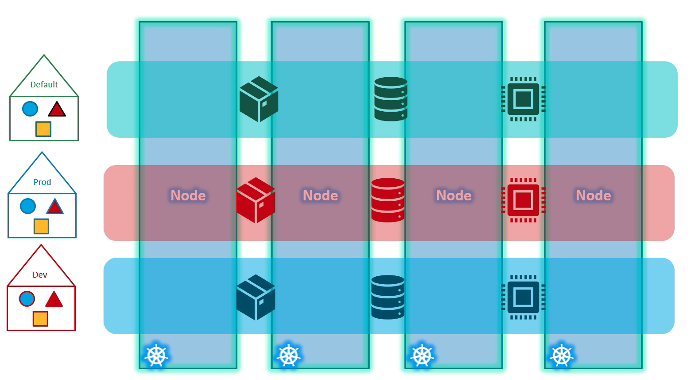
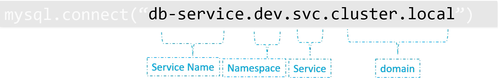

## Core Concepts

**Node:** Node is a machine, physical or virtual one which Kubernetes installed. And node is a worker machine and that is where containers will be launchaned by Kubernetes. It was also known as minion's in the past.

**Cluster:** Cluster is a set of nodes grouped together.
Master node watches over the Nodes in the cluster and is responsible for the actual orchestration of containers on the worker nodes.

When you install Kubernetes on a system you're actually installing the following components.

- **An Api Server:** API Server acts as the fron end for Kubernetes. The users, management devices, command line interfaces; all talk to the API server to interact with Kubernetes cluster.
- **An etcd service:** Etcd service is a distributed reliable key-value store used by Kubernetes to store all data used to manage the cluster. When you have multiple nodes and multiple masters in your cluster, etcd store all that information on all the nodes in the cluster in a distributed manner. etcd is responsible for implementing locks within the cluster to ensure that there are no conflict between the masters.
- **A kubelet service:** Kubelet is the agent that runs on each node in the cluster. The agent is responsible for making sure that the containers are running on the nodes as expected. s
- **A Container Runtime:** The container runtime is the underlying software that is used to run containers. In our case it happens to be Docker, but there are other options as well.
- **Controllers:** The controllers are the brain behind orchestration. They are responsible for noticing and responding when nodes, conatiners or end points goes down.
- **Schedulers:** The scheduler is responsible for distributing work or containers across multiple nodes. It looks for newly created containers and assigns them to nodes. The controllers make decions to bring up new containers in such cases.

    

How are these components distributed across different types of servers. The worker node or minion as it is also known is where the containers are hosted. For example Docker containers and to run Docker containers on a system we need container **Container RunTime** installed. This does not have to be Docker, there are other container runtime alternatives available such as **rkt** (rocket) or **CRI-O**

The master server has the **kube-apiserver** and that is what makes it a master. Similarly the worker nodes have to **kubetet** agent that is responsible for interacting with a master to provide health information of the worker node and carry out actions requested by the Master on the worker nodes. 
All the information gathered are stored in a key value store on the master. The master also has the control manager and the scheduler.

**kubectl (kube control):** The kube control tool is used to deploy and manage applications on a Kubernetes cluster.

**Examples:**

- View information about the cluster
    ```
    kubectl cluster-info
    ```

- List all nodes part of the cluster**
    ```
    kubectl get nodes
    ```

#### POD

Kubernetes does not deploy conatiners directly on the worker nodes. The containers are encapsulated into a Kubernetes object known as pods. A pod is a single instance of an application. A pod is the smallest object that you can create in Kubernetes


What if you need to scale your application? 
You need to add additional instances of your Web application to share the load. Where would you pin up additioanl instances?
Do we bring up new container instance within the same pod? 
The answer is no.
We need to create a new pod with a new instance of the same application. As you can see, we have two instances of the Web application running on two separate pods on the same Kubernetes at a node.
So what if the load gets higher and the current node doesn't have enough capacity? 
Well, then you can always deploye additional pods on a new node in the cluster. You will have a new node added to the cluster to expand the cluster physical capacity.

A single pod can have multiple containers, exccpt for the fact that they're usually not multiple conatiner of the same kind.
If our intention is to scale our application, then we would need to create additional pods.


But sometimes we might have a scenario where we have a helper container that might be doing some kind of supporting task for our Web application, such as processing a user enter data, processing a file uploaded by the user, etc. and you want these helper containers to live alongside your application container.

In that case, you can have both of these containers, part of the same pod, so that when a new application conatiner is created, the helper is also created and when it dies, the helper also dies. Since they are part of the same pod.

The two containers can also communicate with each other directly by referring to each other as localhost, since they share the same network space. Plus they can easily share the same storage space as well.

##### Docker vs Kubernetes


A fundamental difference between Kubernetes and Docker is that Docker is a containerization platform, and Kubernetes is a container orchestrator for container platforms like Docker.

In Docker, we would need to establish network connectivity between containers ourselves using links and networks. 

We would need to create sharable volumes and shared among the containers and need to maintain a map of that as well. 

And most importantly, we will need to monitor the state of the application container, and when it dies, we will manually kill the helper container as it is no longer needed.

When a new container is deployed, we would need to deploy the new helper container as well with pod.

Kubernetes does all of this for us automatically. We just need to define what containers a pod consists of and the containers in a pod by default will have access to the same storage, the same network, namespace and same fate as in they will be created together and destroyed together.

Even if our application didn't happen to be so complex and we could live with a single container, Kubernetes still requires you to create pods.

This is good in the long run as your application is now equipped for architectural changes and scale in the future.

**After this step, Kubernetes must be installed in order to test the commands. You can use the links below for installation.***


<a href="https://kubernetes.io/docs/tasks/tools/install-kubectl-linux/" target="_blank">**`Installation Guide for Linux`**</a>

<a href="https://kubernetes.io/docs/tasks/tools/install-kubectl-macos/" target="_blank">**`Installation Guide for MacOS`**</a>

<a href="https://kubernetes.io/docs/tasks/tools/install-kubectl-windows/" target="_blank">**`Installation Guide for Windows`**</a>

###### How to Deploy Pods?

```bash
$ kubectl run nginx --image nginx
pod/nginx created
```

`kubectl run nginx` command creates a pod automatically and deploys an instance of the nginx docker image, but where does it get application image from?

The application image and in this case the nginx image is downloaded from the repository docker hub. 
Docker hub is a public repository where the latest images of various applications are stored.

We could configure Kubernetes to pull the image from the public or a private repository within the organization.

Now that we have a pod created, how do we see the list of pods available. `kubectl get pods` command helps us see the list of pods in our cluster.

```bash
$ kubectl get pods
NAME    READY   STATUS    RESTARTS   AGE
nginx   1/1     Running   0          8m57s
```
We have create nginx but how a user can access the nginx Web server? So, in the current state, we have not made the Web server accessible to external users. We can access it internally from the node but for now, we can not access the Web server from outside the node.

##### YAML in Kubernetes

Kubernetes uses YAML files as inputs for the creation of objects such as pods, replicasets, deployments, services, etc. All of these follow a similar structure. Kubernetes definition file always contains for top level fields.
The API version, kind, metadata and spec. These are the top level or root level properties. 
These are also required fields, so you must have them in your configuration file.

```properties
apiVersion: v1
kind: Pod
metadata:
    name: myapp-pod
    labels:
        app: myapp
        type: front-end

spec:
    containers:
        - name: nginx-container
          image: nginx
```
**apiVersion:** Version of the Kubernetes API we are using to create the object. Depending on what we are trying to create, we must use the right API version. Since we're working on pods, we will set the API version as `v1`. Few other possible values for this field are apps/v1-beta extension/v1-beta etc.

**kind:** kind  refers to type of object we are trying to create which in this case happens to be a pod. So, we will set it as `Pod`. Could be replica set, deployment or service.

**metadata:** The metadata is data about the object like its name, labels, etc. Unlike the first two where we have specified a string value this is in the form of a dictionary. So, everything under metadata is intended to the right a little bit and so name and labels are children of metadata. Children's (name and labels) locations should be the same as their sibling's.

Under metadata the name is a string value so we can name our pod. `myapp-pod` and the labels is a dictionary, so labels is a dictionary within the metadata dictionary. 
And it can have any key and value pairs as we wish. 

For now, we have added a label app with the value `myapp`. 

Similarly, we could add other labels as we see fit which will us identify these objects at a later point in time.

For example. there are hundreds of pods running a front end application and hundreds of pods running a backend application or a database. It will be difficult to group these pods once they're deployed.

If we label them now as `front-end` backend or database, we will be able to filter the parts based on this label at a later point in time.

It's important to keep in mind that under metadata we can only specify name or labels or anything else that Kubernetes expects to be under metadata.

We can not ad any other property as we wish under metadata. However under the labels we can have any kind of key or value pairs we see fit. 

So it's important to understand what each of these parameters expect.

**spec:** Spec is dictionary has a property under it called `containers`. Containers is a list an array. The reason this property is a list is because the pods can have multiple containers witin them. In this case, we will only add a single item in the list since we plan to have only a single container in the pod. 
The `-` right before the name indicates that this is the first item in the list. The item in the list is a dictionary so add name and image property the value for image is nginx which is the name of the Docker image in the docker repository.
Once the file is created from the command `kubectl create -f pod-definition.yml` followed by the file name which is pod-definition.yml and Kubernetes creates a pod.

The table below summarizes the Type of Fields.

|field     |type      | 
|----------|----------|
|apiVersion|string    |
|kind      |string    |
|metadata  |dictionary|
|name      |string    |
|labels    |dictionary|
|app       |string    |
|type      |string    |
|spec      |dictionary|
|containers|list      |

To create a pod with the above yml file;

```bash
$ kubectl create -f pod-definition.yml
pod/myapp-pod created
```
kubectl decribe command will tell us information about the pod; when it was created, what labels are assinged to it, what docker containers are a part of it, and the events associated with that pod.

```bash
$ kubectl describe pod nginx
Name:         nginx
Namespace:    default
Priority:     0
Node:         10.0.10.25/10.0.10.25
Start Time:   Fri, 22 Oct 2021 08:20:40 +0000
Labels:       run=nginx
Annotations:  <none>
Status:       Running
IP:           10.244.1.2
IPs:
  IP:  10.244.1.2
Containers:
  nginx:
    Container ID:   cri-o://bf5109681523311b60c40189b5efeee01114ff238f59861770b16def10f3aa7f
    Image:          nginx
    Image ID:       docker.io/library/nginx@sha256:644a70516a26004c97d0d85c7fe1d0c3a67ea8ab7ddf4aff193d9f301670cf36
    Port:           <none>
    Host Port:      <none>
    State:          Running
      Started:      Fri, 22 Oct 2021 08:20:48 +0000
    Ready:          True
    Restart Count:  0
    Environment:    <none>
    Mounts:
      /var/run/secrets/kubernetes.io/serviceaccount from default-token-kd5vg (ro)
Conditions:
  Type              Status
  Initialized       True 
  Ready             True 
  ContainersReady   True 
  PodScheduled      True 
Volumes:
  default-token-kd5vg:
    Type:        Secret (a volume populated by a Secret)
    SecretName:  default-token-kd5vg
    Optional:    false
QoS Class:       BestEffort
Node-Selectors:  <none>
Tolerations:     node.kubernetes.io/not-ready:NoExecute op=Exists for 300s
                 node.kubernetes.io/unreachable:NoExecute op=Exists for 300s
Events:          <none>
```

**Example:**

We can add anything on the labels that will help you group this section in the future.

```properties
apiVersion: v1
kind: Pod
metadata:
  name: myapp-pod
  labels:
    app: myapp
    type: front-end
    costcenter: EMEA
    location: Amsterdam
spec:
    containers:
        - name: nginx-container
          image: nginx
```

Before creating a pod with the above script, if it already exists, it can be listed and deleted with the following commands.

```bash
% kubectl get pods                  
NAME        READY   STATUS    RESTARTS   AGE
nginx       1/1     Running   0          2d19h

% kubectl delete pod nginx
pod "nginx" deleted

% kubectl create -f pod-definition.yml
pod/myapp-pod created
```

If you have more than 1 image and you want to list all image names, the below command can be used.

```
% kubectl describe pod | grep Image
    Image:          nginx
    Image ID:       docker.io/library/nginx@sha256:644a70516a26004c97d0d85c7fe1d0c3a67ea8ab7ddf4aff193d9f301670cf36
```

To find the nodes where the pods are located

```
% kubectl get pods  -o wide
NAME        READY   STATUS    RESTARTS   AGE     IP           NODE         NOMINATED NODE   READINESS GATES
myapp-pod   1/1     Running   0          4h18m   10.244.1.3   10.0.10.25   <none>           <none>
```

##### Editing Existing Pods

1. If you are given a pod definition file, edit that file and use it to create a new pod.

2. If you are not given a pod definition file, you may extract the definition to a file using the below command.

    ```bash
    kubectl get pod <pod-name> -o yaml > pod-definition.yaml
    ```

    Then edit the file to make the necessary changes, delete and re-create the pod.

3. Use the `kubectl edit pod <pod-name>` command to edit pod properties.

#### Kubernetes Replication Controllers


Containers are the brain behind Kubernetes. They're the processes that monitor Kubernetes objects and respond accordingly.

One of the most important controllers is the replication controller.

To prevent users from losing access to the application, we would like to have more than one instance or pod running at the same time. That way, If one fails, we still have our application running on the other one.

The replication controller helps us multiple instance of a single pod in the Kubernetes cluster, thus providing high availability.

Even if you have a single pod, the replication controller can help by automatically bringing up a new pod when the existing one fails, thus the replication controller ensures that the specified number of pods are running at all times, even if it's just one or hundred.

##### Load Balancing & Scaling

Another reason we need replication controller is to create multiple parts to share the load across them.

For example, we have a single pod serving a set of users, when the number of users increase, we deploy additional pod to balance the load across the two pods.

If the demand further increases and if we were run out if resources on the first node, we could deploy additional parts across the other nodes in the cluster.

It's important to note that there are two similar terms, `Replicaton Controller` and `ReplicaSet` both have the same purpose, but they're not the same.

Replication Controller is the older technology that is being replaced by ReplicaSet, is the new recommended way to set up replication.

**Replication Controller Example:**
The Replication Controller configuration file and the previously used configuration file are very similar to each other.

The extra thing to do here is to move all the contents of the pod definition (metadata and spec parts) to the template section of the file replication controller. They should be children of the template section.

Looking at our file now, we have two metadata sections; one is for the replication controller and another for the pod. And also we have two spec section one for each.

The replicas parameter is the number that determines how many pod there will be at a time. It is important to note that replicas and template sections are direct children of the spec section.

```properties
apiVersion: v1
kind: ReplicationController
metadata:
  name: myapp-rc
  labels:
    app: myapp
    type: frontend
spec:
  template:
   ---
```

```properties
apiVersion: v1
kind: ReplicationController
metadata:
  name: myapp-rc
  labels:
    app: myapp
    type: frontend
spec:
  template:
    metadata:
      name: myapp-pod
      labels:
        app: myapp
        type: front-end    
    spec:
      containers:
      - name: nginx-container
        image: nginx
  replicas: 3
```

Using the yaml file, to create a Replication Controller and check its status;

```bash
% kubectl create -f rc-definition.yml 
replicationcontroller/myapp-rc created

% kubectl get replicationcontroller
NAME       DESIRED   CURRENT   READY   AGE
myapp-rc   3         3         3       91s
```

If you would like to see the pods that were created by the replication controller and you will see three pods running. All of them are starting with the name of the replication controller which is myapp-rc, indicating that are all created automatically by the replication controller.

```bash
% kubectl get pods            
NAME             READY   STATUS    RESTARTS   AGE
myapp-rc-gfr2j   1/1     Running   0          54s
myapp-rc-kvq6d   1/1     Running   0          54s
myapp-rc-x4d2k   1/1     Running   0          54s
```

**Replicaset Example:**

It's very similar to replication controller. 
- apiVersion is different what we had before for application controller
- The spec section is exactly the same except!
  - ReplicaSet requires a selector definition, the selector section helps the ReplicatSet identify what pods fall under it. It's because ReplicaSet also manage pods that were not created as part of the ReplicaSet creation. For example, there were pods created before the creation of the ReplicaSet that matched labels specified in the selector. The ReplicaSet also take those pods into consideration when creating the replicas.
  The selector is not a required field in case of a replication controller, but it's still available. When you skip, it assumes it to be the same as the labels provided in the pod definition file. In case of ReplicaSet, a user input is required for this property and it has to be written in the form of `MatchLabels`.
- A MatchLabel selector simply matches the labels specified under it to the labels on the pod.
- The ReplicaSet selector also provides many other options for matching labels that were not available in the replication controller.

```properties
apiVersion: apps/v1
kind: ReplicaSet
metadata:
  name: myapp-replica
  labels: 
    app: myapp
    type: front-end
spec:
  template:
    metadata:
      name: myapp-pod
      labels:
        app: myapp
        type: front-end    
    spec:
      containers:
      - name: nginx-container
        image: nginx
  replicas: 3
  selector:
    matchLabels:
      type: front-end
```

Using the yaml file, to create a ReplicaSet and check its status;

```bash
% kubectl create -f replicaset-def.yml
replicaset.apps/myapp-replica created

% kubectl get pods                    
NAME                  READY   STATUS    RESTARTS   AGE
myapp-replica-kdl2k   1/1     Running   0          16s
myapp-replica-v5srg   1/1     Running   0          16s
myapp-replica-xnqbz   1/1     Running   0          16s

% kubectl get replicaset
NAME            DESIRED   CURRENT   READY   AGE
myapp-replica   3         3         3       41s
```

##### Labels and Selectors


Why do we label our pods and objects in Kubernetes?

Say we deployed three instances of our front-end Web application as three pods. We would like to create a replication controller or replicaset to ensure that we have three active pods at any time.

I case they were not created, the replicaset will create them for you. The role of the replicaset is to monitor the pods and if any of them were to fial, deploy a new ones. The replica set is in fact a process that monitors the pods.

There could be hundreds of other pods in the cluster running different applications. This is where labeling our pods during creation comes in handy.

```properties
metadata:
  name: myapp-pod
  labels:
    tier: front-end
```

```properties
selector:
  matchLabels:
    tier: front-end
```

We could provide labels as a filter for replicaset under the selector section, by using the matchLabels filter we can provide the same label we used when creating the pods.


This way the replicaset knows which pods of monitor.
The same conecpt of labels and selectors is used in many other places throughout Kubernetes.

##### Scale

Say we started with three replicas in the future we decided to sclae to six.
There are multiple ways to do it.

1. Update the number of replicas in the definition file to six.

    ```
    replicas: 6
    selector:
      matchLabels:
        type: front-end
    ```

    Then run the `kubectl replace -f replicaset-definition.yml` command to specify the same file and that will update the replica set to have six replicas.

2. Run the kubectl scale command used the replicas parameter to provide the new number of replicas and specify the same file as input.

    ```
    kubectl scale --replicas=6 -f replicaset-definition.yml
    ```

    We either input the definition file or provide the replicaset name in the type name format.

    ```
    kubectl scale --replicas=6 replicaset myapp-replicaset
    ```

    However, remember that using the filename as an input will not update the existing number of replicase in the file.
    In other words, the number of replicas in the replicaset-definition.yml file will still be three, even though you scaled your replica set to have six replicas using the kubectl scale command and the file as input.

##### Commands

- Create a replicaset 
  > kubectl create -f replicaset-definition.yml

- List of public assets created
  > kubectl get replicaset

- Delete the replicaset and also deletes all underlying PODs
  > kubectl delete replicaset myapp-replicaset

- Replace or update the replica set.
  > kubectl replace -f replicaset-definition.yml

- Scale replicaset simply from the command line without having to modify the file
  > kubectl scale -replicas=6 -f replicaset-definition.yml

- Edit replicaset
  > kubectl edit replicaset

#### Deployments



You have a Web server and that needs to be deployed in a production environment. You need many instances of running web server. And also whenever a newer version of application builds become available on the Docker registry and if you upgrade them all at once, this may impact users accessing the application. So, you might want to upgrade them one after the other.

Let's say your upgrade resulted in an error and you want to roll back the changes that were recently carried out.

Another scenario that can be illustrated is,you would like to make multiple changes to your environment such as upgrading the underlying web server versions, scaling the environment, modifying the resource allocations etc...

And you would like to apply a pause to your environment, make the changes and then resumes. So, all the changes are rolled out together.

All of these capabilities are available with the Kuberetes deployments.

Each container is encapsulated in PODs. Multiple set PODs are deployed using replication controllers or replicaset.
And then comes deployment which is a Kubernetes object that comes higher in the hierarchy.

The deploymeny provides us with the capability to upgrade the underlying instances seamlessly using rolling updates, undo changes, pause and resume changes as required.

Replicaset and deployment definition files are similar. Except for the kind which is going to be deployment.

```properties
apiVersion: apps/v1
kind: Deployment
metadata:
  name: myapp-deployment
  labels: 
    app: myapp
    type: front-end
spec:
  template:
    metadata:
      name: myapp-pod
      labels:
        app: myapp
        type: front-end    
    spec:
      containers:
      - name: nginx-container
        image: nginx
  replicas: 3
  selector:
    matchLabels:
      type: front-end
```

```bash
% kubectl create -f deployment-definition.yml
deployment.apps/myapp-deployment created

% kubectl get replicaset                     
NAME                          DESIRED   CURRENT   READY   AGE
myapp-deployment-7df67f74c5   3         3         3       6s

% kubectl get pods      
NAME                                READY   STATUS    RESTARTS   AGE
myapp-deployment-7df67f74c5-lnnzq   1/1     Running   0          13s
myapp-deployment-7df67f74c5-ndb8n   1/1     Running   0          12s
myapp-deployment-7df67f74c5-zdfgq   1/1     Running   0          12s
```

Deployment automatically creates a Replica Set and PODs. If we run the commands, we will be able to see the PODs with the name of deploymant and replicaset.

So far there has not been much of a difference between replicaset and deployments. Except for the fact that deployment created a new Kubernetes object called deployments.

- To see all created objects at once
  > kubectl get all

  ```bash
  % kubectl get all
  NAME                                    READY   STATUS    RESTARTS   AGE
  pod/myapp-deployment-7df67f74c5-lnnzq   1/1     Running   0          4m52s
  pod/myapp-deployment-7df67f74c5-ndb8n   1/1     Running   0          4m51s
  pod/myapp-deployment-7df67f74c5-zdfgq   1/1     Running   0          4m51s

  NAME                 TYPE        CLUSTER-IP   EXTERNAL-IP   PORT(S)   AGE
  service/kubernetes   ClusterIP   10.96.0.1    <none>        443/TCP   5d1h

  NAME                               READY   UP-TO-DATE   AVAILABLE   AGE
  deployment.apps/myapp-deployment   3/3     3            3           4m52s

  NAME                                          DESIRED   CURRENT   READY   AGE
  replicaset.apps/myapp-deployment-7df67f74c5   3         3         3       4m52s
  ```

##### Output Commands

The default output format for all kubectl commands is the human-readable plain-text format. The -o flag allows us to output the details in several different formats.

> kubectl [command] [TYPE] [NAME] -o <output_format>

Here are some of the commonly used formats:

1. `-o json` output a JSON formatted API object.

2. `-o name` print only the resource name and nothing else.

3. `-o wide` output in the plain-text format with any additional information.

4. `-o yaml` output a YAML formatted API object.

**You can check the following links for more details.**

- [Overview](https://kubernetes.io/docs/reference/kubectl/overview/)

- [Cheat Sheet](https://kubernetes.io/docs/reference/kubectl/cheatsheet/)

#### Namespaces



Let's assume there are two boys named Michael to differentiate them from each other, we call them by their last names Jordan and Jackson.
They come from different houses and there are other members in the house. Individuals in the household only address each other by their first names.

For example, the father addresses is Michael. However, if the father wishes to address Michael in the other house, he uses his full name. (Michael Jackson)

Someone outside of these houses would also use the full name to refer to anyone these houses.

Each of these houses have their own set of rules that defines who does what. Each of these houses have their own set of resources that can consume.

These houses correspond to Namespaces in Kubernetes.

We have created objects such as PODs, Deployments and services in our cluster. Whatever we have been doing, we have been doing within a Namespace.

We were inside a house all this while, this namespace is known as the default Namespace and it's created automatically by Kubernetes when the cluster is first setup.

Kubernetes creates a set of PODs and services for it's internal purpose such as those required by the networking solution, the DNS service etc.

To isolate these from the user and to prevent accidentally deleting or modifying the services, Kubernetes creates them under another Namespace created at cluster startup named `kube-system`.

A third namespace created by Kubernetes automatically is called `kube-pulic`. This is where resources that should be made available to all users are created.



If you want to use the same cluster both Dev and Production environment but at the same time isolate the resources between them, you can create a different namespace for each of them.

That way while working in the Dev environment you don't accidentally modify resources in production.

Each of these Namespaces can have it's own set of policies that define who can do what.

We can also assign POD of resources to each of these Namespaces, that way each Namespace is guaranteed a certain amount and does not use more its allowed limit.

The default Namespace that we've been working on, just like how the members within the house refer to each other by their first names. The resources within a namespace can refer to each other simply by their names.

**Example:**
  - **Namespace:** Default
  - **Objects:**
    - web-pod
    - db-service
    - web-deployment

In this case, the webapp-pod can reach db-service simlpy using the hostname db-service.

> mysql.connect("db-service")

If required, the webapp-pod can reach a service in another Namespace as well. For this you must append the name of the namespace to the name of the service.

For example for the web-pod in the default namespace to connect to the database in the Dev environment, in this case format should be `service.namespace.svc.cluster.local` 

> mysql.connect("db-service.dev.svc.cluster.local")

We're able to do this because when the service is created a DNS entry is added automatically in this format.

Looking closely at the DNS name of the service, the last part `cluster.local` is the default domain name of the Kubernetes cluster `.svc` is the subdomain for service followed by the namespace and then the name of the service itself.



To list PODs in another namespace, we need to use the namespace option in the command along with the name of the namespace.

```bash
% kubectl get pods --namespace=kube-system
NAME                                   READY   STATUS    RESTARTS   AGE
coredns-7db99fc7fb-7fj9c               1/1     Running   0          6d11h
coredns-7db99fc7fb-lpjnv               1/1     Running   0          6d11h
coredns-7db99fc7fb-zt4ww               1/1     Running   0          6d11h
csi-oci-node-cxh6l                     1/1     Running   1          6d11h
csi-oci-node-h5jk9                     1/1     Running   0          6d11h
csi-oci-node-hmskj                     1/1     Running   0          6d11h
kube-dns-autoscaler-696f8695ff-rwbdd   1/1     Running   0          6d11h
kube-flannel-ds-gr4f6                  1/1     Running   0          6d11h
kube-flannel-ds-klfxr                  1/1     Running   0          6d11h
kube-flannel-ds-r6dsz                  1/1     Running   0          6d11h
kube-proxy-6lq74                       1/1     Running   0          6d11h
kube-proxy-lp25n                       1/1     Running   0          6d11h
kube-proxy-qm7k2                       1/1     Running   0          6d11h
proxymux-client-lhcjc                  1/1     Running   0          6d11h
proxymux-client-lzfzm                  1/1     Running   0          6d11h
proxymux-client-p5cfh                  1/1     Running   0          6d11h
```

To create a pod in anothe namespace, we need to use the namespace option.

> kubectl create -f pod-definition.yml --namespace=dev

If we want to make sure that this pod gets created in the dev environment all the time even if we don't specify the namespace in the command line, we can put the namespace definition into the pod definition file under the metadata section.

```properties
metadata:
  name: myapp-pod
  namespace: dev
  ...
```

So, how do we create a new namespace? Like any other object, use a namespace definition file. The API version is v1, kind is namespace and under metadata specify the name.

```properties
apiVersion: v1
kind: namespace
metadata:
  name: dev
```

```bash
% kubectl create -f namespace-dev.yml
namespace/dev created
```

Another way to create a namespace is by simply running the command kubectl create namespace followed by the name of the namespace.

```bash
% kubectl create namespace prod
namespace/prod created
```

But what if we want to switch to the dev namespace permanently so that we don't have to specify the namespace option anymore.

In that case use the kubectl config command to set the namespace in the current context to dev.

> kubectl config set-context $(kubectl config current-context) --namespace=dev

```bash
% kubectl create -f pod-definition.yml --namespace=dev
pod/myapp-pod created

% kubectl config set-context $(kubectl config current-context) --namespace=dev
Context "context-cklkyy5l4pa" modified.

% kubectl get pod
NAME        READY   STATUS    RESTARTS   AGE
myapp-pod   1/1     Running   0          54s
```

Similary. we can switch to the prod namespace the same way.

To view pods in all namespace, we can use the all namespaces option in the command.


```bash
% kubectl get pods --all-namespaces

NAMESPACE     NAME                                   READY   STATUS    RESTARTS   AGE
default       myapp-deployment-7df67f74c5-lnnzq      1/1     Running   0          34h
default       myapp-deployment-7df67f74c5-ndb8n      1/1     Running   0          34h
default       myapp-deployment-7df67f74c5-zdfgq      1/1     Running   0          34h
dev           myapp-pod                              1/1     Running   0          3m24s
kube-system   coredns-7db99fc7fb-7fj9c               1/1     Running   0          6d11h
kube-system   coredns-7db99fc7fb-lpjnv               1/1     Running   0          6d11h
kube-system   coredns-7db99fc7fb-zt4ww               1/1     Running   0          6d11h
kube-system   csi-oci-node-cxh6l                     1/1     Running   1          6d11h
kube-system   csi-oci-node-h5jk9                     1/1     Running   0          6d11h
kube-system   csi-oci-node-hmskj                     1/1     Running   0          6d11h
kube-system   kube-dns-autoscaler-696f8695ff-rwbdd   1/1     Running   0          6d11h
kube-system   kube-flannel-ds-gr4f6                  1/1     Running   0          6d11h
kube-system   kube-flannel-ds-klfxr                  1/1     Running   0          6d11h
kube-system   kube-flannel-ds-r6dsz                  1/1     Running   0          6d11h
kube-system   kube-proxy-6lq74                       1/1     Running   0          6d11h
kube-system   kube-proxy-lp25n                       1/1     Running   0          6d11h
kube-system   kube-proxy-qm7k2                       1/1     Running   0          6d11h
kube-system   proxymux-client-lhcjc                  1/1     Running   0          6d11h
kube-system   proxymux-client-lzfzm                  1/1     Running   0          6d11h
kube-system   proxymux-client-p5cfh                  1/1     Running   0          6d11h
```

Taking a closer look at the command `kubectl config set-context $(kubectl config current-context) --namespace=dev`, this command first identifies the current context and then sets the namespace to the desired one for that current context. Context are used to manage multiple clusters in multiple environments from the same management system.

##### Resource Quota

To limit resources in a namespace, we can create a resource quota. We first need to specify the namespace for which we want to create a quota and the under spec, we can provide our limits then creat the quota.

```properties
apiVersion: v1
kind: ResourceQuota
metadata
  name: compute-quota
  namespace: dev
spec:
  hard:
    pods: "10"
    request.cpu: "4"
    request.memory: 5Gi
    limits.pu: "10"
    limits.memory: 10Gi
```

> kubectl create -f compute-quota.yaml

#### Imperative commands

Although we mostly work declaratively using definition files, we can quickly handle one-time tasks using imperative commands and at the same time easily create a definition template.

By default as soon as the command is run, the resource will be created. If you simply want to test your command use the below option. This will not create the resource, instead, tell you whether the resource can be created and if your command is right.
  - `--dry-run=client`

##### Pod

1. Create an NGINX Pod
  - `kubectl run nginx --iname=nginx`

2. Generate Pod manifest yaml file with `-o yaml option`. This command will not create it with the `--dry-run` option. 

  - `kubectl run nginx --image=nginx --dry-run=client -o yaml`

##### Deployment

1. Generate deployment with 4 replicas

  - `kubectl create deployment nginx --iname=nginx --replicas=4`

2. Scale a deployment 

  - `kubectl scale deployment nginx --replicas=5`

3. Alternatife way to generate deployment is to save the yaml definition to a file and modify.

  - `kubectl create deployment nginx --image=nginx --dry-run=client -o yaml > nginx-deployment.yaml`

  We can save then update the yaml file with the other fields before creating the deployment.

##### Service

1. Create a service named redis-service of type ClusterIP to expose pod redis on port 6379. The following command will automatically use the pod's labels as selectors.

  - `kubectl expose pod redis --port=6379 --name redis-service --dry-run=client -o yaml`

2. Alternatife way of 1. The following command will not use the pods labels as selectors, instead it will assume selectors as **app=redis**

  - `kubectl create service clusterip redis --tcp=6379:6379 --dry-run=client -o yaml`

3. Create a service named ngix of type NodePort to expose pod nginx's port 80 on port 30080 on the nodes. The following command will automatically use the pod's labels as selectors but we can not specify the node port. We have to generate a definition file and then add the node port in manually before creating the service with the pod.

  - `kubectl expose pod nginx --port=80 --name nginx-service --type=NodePort --dry-run=client -o yaml`

4. Alternatife way of 3. The following command will not use the pods labels as selectors

  - `kubectl create service nodeport nginx --tcp=80:80 --node-port=30080 --dry-run=client -o yaml`

    Both the above commands have their own challenges. While one of it cannot accept a selector the other cannot accept a node port.

    If you need to specify a node port, create a definition file using the same command and enter the node port manually before creating the service.

 [Reference Link](https://kubernetes.io/docs/reference/kubectl/conventions/)

**Examples:** 

1. Create a new pod called custom-nginx using the nginx image and expose it on container port 8080.

    > kubectl run custom-nginx --image=nginx --port=8080

2. Create a pod called httpd using the image httpd:alpine in the default namespace. Next, create a service of type ClusterIP by the same name (httpd). The target port for the service should be 80.

    > kubectl run httpd --image=httpd:alpine --port=80 --expose

## Configuration

#### Commands & Arguments

To create a simple docker image that sleeps for a given number of seconds, we can named it ubuntu-sleeper and use the following command.

> docker run --name ubuntu-sleeper ubuntu-sleeper

By default, it sleeps for five seconds, but we can override by passing a command line argument.

> docker run --name ubuntu-sleeper ubuntu-sleeper 10

We will now create a pod using this image with additional argument in the pod definition file.

Anything that is appended to the docker run command will go into the `args` property off the pod definition file in the form of an array line below.

```properties
apiVersion: v1
kind: Pod
metadata:
  name: ubuntu-sleeper-pod
spec:
  containers:
    - name: ubuntu-sleeper
      image: ubuntu-sleeper
      args: ["10"]
```

The docker file has an entry point as well as CMD instructions specified. The entry point is the command that is run at statup and the CMD is the default parameter passed to the command. With the args option in the pod definition file, we override the code CMD instruction in the docker file.

But what if we need to override the entry point? For instance, from sleep to an imaginary sleep 2.0 command.

In the docker world, we can run with entrypoint option set to the new command as follows.

> docker run --name ubuntu-sleeper --entrypoint sleep2.0 ubuntu-sleeper 10

The corresponding entry in the pod definition file would be using a command field. The command field corresponds to entry point instruction in the docker file.

```properties
apiVersion: v1
kind: Pod
metadata:
  name: ubuntu-sleeper-pod
spec:
  containers:
    - name: ubuntu-sleeper
      image: ubuntu-sleeper
      command: ["sleep2.0"]
      args: ["10"]
```

To summarize, there are two fields that correspond to instructions in the docker file, 
- The command field overrides the entry point instruction 
- The args field overrides the command instruction in the docker file.

##### Editing PODs and Deployments

###### Edit PODs

We can not edit specifications of an existing POD other than the below.

- spec.containers[*].image
- spec.initContainers[*].image
- spec.activeDeadlineSeconds
- spec.tolerations

For example, we cannot edit the environment variables, service accounts, resource limits of a running pod. But if we really want to, we have 2 options.

1. Run the `kubectl edit pod <pod name>` command.

  This command will open the pod specification in an editor (vi editor). Then edit the required properties. When we try to save it, you will be denied.

  This is because we are attempting to edit a field on the pod that is not editable.

  ```bash
    % kubectl edit pod myapp-pod
    error: pods "myapp-pod" is invalid
    A copy of your changes has been stored to "/var/folders/7v/btvm72w972qbg3zcxgfnl80m0000gn/T/kubectl-edit-1351316848.yaml"
    error: Edit cancelled, no valid changes were saved
  ```

  A copy of the file with your changes is saved in a temporary location as shown above.

  We can then delete the existing pod by running the command,

  ```bash
  kubectl delete pod webapp
  ```

  Then create a new pod with your changes using the temporary file,

  ```bash
  kubectl create -f /var/folders/7v/btvm72w972qbg3zcxgfnl80m0000gn/T/kubectl-edit-1351316848.yaml
  ```

2. The second option is to extract the pod definition in YAML format to a file using the command.

  ```bash
  kubectl get pod myapp-pod -o yaml > my-new-pod.yaml
  ```

  Then make the changes to the exported file using an editor (vi editor). Save the changes

  > vi my-new-pod.yaml

  Then delete the existing pod

  > kubectl delete pod myapp-pod

  Then create a new pod with the edited file

  > kubectl create -f my-new-pod.yaml

###### Edit Deployments

With Deployments we can easily edit any field/property of the POD template.

Since the pod template is a child of the deployment specification, with every change the deployment will automatically delete and create a new pod with the new changes. 

So if you are asked to edit a property of a POD part of deployment we may do that simply by running the command

> kubectl edit deployment my-deployment

#### Environment Variables

When we want to set an environment, we can use the env attribute in the YAML file. Env is an array so every item under the env property startus with a "-" indicating an item in the array.

Each item has a name and a value property.
The name is the name of the environment variable made available with the container and the value is its value.

```properties
spec:
  env:
    - name:  app_colur
      value: blue
```

A direct way of specifying the environment variables using a plain key-value pair format. However there are other ways of setting the environment variables such as using config maps and secrets.

The difference in this case is that instead of specifying value we say `valueFrom` and the specification od conflict maps and secret keys.

```properties
spec:
  env:
    - name:  app_colur
      valueFrom:
        configMapKeyRef:
```

```properties
spec:
  env:
    - name:  app_colur
      value: blue
```

##### ConfigMaps

When we have a lot of pod definition file, It will become difficult to manage the environment data stored within the various files.

We can take this information out of the pod definition file and manage it centrally using configuration maps.

Config maps are used to pass configuration data in the form of key value pairs in Kubernetes.

When the pod is created, the config map is injected into the pod. So the key-value parents are available as environment variables for the application hosted inside the container in the pod.

There are two phases involved in configuring config maps.

1. Create the ConfigMap
2. Inject them into the pod.

There are two ways of creating a ConfigMap. The imperative way, without using a definition file and the declarative way by using a config  map definition file.

<span style="color:red">Imperative</span>
> kubectl create configmap

<span style="color:green">Declarative</span>
> kubectl create -f config-map.yaml

**<span style="color:red">Imperative Example:</span>**

```bash
kubectl create configmap \
  <config-name> --from-literal=<key>=<value>
```

```bash
kubectl create configmap \
  app-config --from-literal=APP_COLOR=blu
```
If you wish to add addinitiol key value pairs, simply specify the from-literal options multiple times.

```bash
kubectl create configmap \
  app-config --from-literal=APP_COLOR=blu \
  app-config --from-literal=APP_MOD=prod
```

However, this will get complicated when we have too many configuration items.

Another way to input configuration data is through a file.

```bash
kubectl create configmap \
  app-config --from-file=app_config.properties
```

**<span style="color:green">Declarative Example:</span>**

For the declarative approach, we can create a definition file. In the same way as in the pod file; file has apiVersion, type and metadata. But here we have data instead of spec. Let's say the file is named config-map.yaml.

```properties
apiVersion: v1
kind: ConfigMap
metadata:
  name: app-config
data:
  APP_COLOR: blue
  APP_MODE: prod
```
> kubectl create -f config-map.yaml

We can create as many ConfigMaps as wee need in the same way for vaious different purposes.

- To list configmaps
  > kubectl get configmaps

- To list the configuration data
  > kubectl describe configmaps

###### ConfigMap in Pods

Below is a simple example pod definition file for the web application. 

```properties
apiVersion: v1
kind: Pod
metadata:
  name: simple-webapp-colur
  labels:
    name: simple webapp-color
spec:
  containers:
  - name: simple-webapp-color
    image: simple-webapp-color
    ports:
      - containerPort: 8080
```

To inject an environmet variable, add a new property to the container called `envFrom`. The envFrom property is a list so we can pass as many environment variables as required.

Each item in the list corresponds to a configmap item. We can specify name of the configMap we created earlier.

```properties
spec:
  containers:
  - name: simple-webapp-color
    image: simple-webapp-color
    ports:
      - containerPort: 8080
    envFrom:
      - configMapRef:
          name: app-config
```

The name of the ConfigMapRef should be the same as the name of the config-map we created before. And now we just need to create a pod with the above definition file.

> kubectl create -f pod-definition.yaml